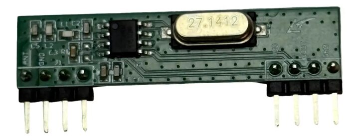
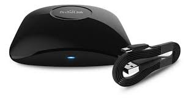

# broadlink-rf-gpio-receiver

**Make your Raspberry Pi react when you press a cheap 433 MHz remote or doorbell.**

Lots of cheap gadgets use little 433 MHz radio remotes: doorbells, garage
buttons, RGB strip remotes, PIR motion/door sensors. A **Broadlink RM** (a smart
IR/RF blaster) can *record* and *replay* those signals — but it can't tell you
the moment someone presses the button. A **cheap 433 MHz receiver chip** wired
to your Pi *can* hear the button, but on its own it just hears a messy stream of
radio static with the signal buried inside, and has no idea what it means.

This little Python script connects the two: you record a button once with the
Broadlink, and the script teaches your Pi to recognize *"hey, that was the
doorbell!"* whenever the cheap receiver hears it again — so your Pi can run
anything you want in response (ping your phone, turn on a light, log it, ...).

## What you need

- A **Raspberry Pi**.
- A **433 MHz receiver module**. I tested it with a **HopeRF RFM210LH**
  (sold as *"Rfm210 Subghz Hoperf 433mhz Raw Th"*) and it worked well. I also
  tried the very cheap **XY-MK-5V** and **MX-RM-5V** modules and couldn't get
  them to work — not sure if it was them or me, but the RFM210 was painless.
- A **Broadlink RM** (RM4 Pro / RM Pro) to record your remotes once.

<p>
  
  
</p>

<sub>Left: the HopeRF RFM210LH receiver (note the two header rows — antenna/power on one side, data on the other). Right: a Broadlink RM4 Pro, used once to record each remote.</sub>

## Wiring (RFM210LH)

```
RFM210LH        Raspberry Pi
  DOUT  ----->  GPIO 27 (physical pin 13)   # change with --pin
  VCC   ----->  3.3V    (pin 1)             # NOT 5V: the GPIO isn't 5V tolerant
  GND   ----->  GND     (pin 6)
  ANT   ----->  one ~17 cm jumper wire (this is your antenna)
```

The RFM210 has a header/dupont pin for the antenna, so you can just plug a
dupont cable into it and let it dangle — no soldering. Range is much better
with it than without.

## Install

```bash
pip install pigpio broadlink
sudo pigpiod        # start the pigpio helper (once per boot)
```

## Self-test without any hardware (optional)

Just want to see the matching logic work, or sanity-check your install?

```bash
python3 examples/offline_demo.py
```

This **fakes** the radio pulses in software — no Pi, no receiver, no Broadlink —
and shows the decode + match step the script normally does live. It's only a
demo of the brains; the real thing below needs the hardware.

## Real usage

**1. Record each remote button once** with your Broadlink into a `codes.json`:

```json
{ "doorbell": { "button": "<broadlink hex packet>" } }
```

Any Broadlink "learn" tool produces this format. (`codes.example.json` is a fake
sample so the commands below run immediately.)

**2. See what loaded** and the signature derived for each button:

```bash
python3 rf_code_info.py --codes codes.json
python3 rf_receiver.py --list --codes codes.json
```

**3. Listen.** Debug mode prints every frame it decodes — use it to confirm your
remote is actually being heard:

```bash
python3 rf_receiver.py --codes codes.json
```

**4. Run actions** when a known button is detected. Edit the `ACTIONS` dict at
the top of `rf_receiver.py`, then:

```bash
python3 rf_receiver.py --daemon --codes codes.json
```

### Example: doorbell → notification

```python
# rf_receiver.py
ACTIONS = {
    "doorbell/button": ["python3", "/home/pi/notify.py", "Someone's at the door"],
}
```

## How it works (short version)

- A Broadlink capture is turned into a list of pulse lengths, and from that a
  24-bit "fingerprint" of the button. (These remotes use PT2262/EV1527 chips
  that send a fixed code.)
- The cheap receiver spits out a noisy stream of pulse edges all the time. The
  script watches that stream and, whenever a chunk matches a known fingerprint
  closely enough, fires `on_match`.
- It's built to cope with the messiness of cheap receivers: constant background
  noise, garbage before the real signal, and a few dropped/uncertain bits.

Full write-up: [`docs/broadlink_to_gpio.md`](docs/broadlink_to_gpio.md).

## Notes

- The receiver chip is *always* emitting noise; never treat raw GPIO activity as
  a button press. Only act on `on_match`.
- Works with fixed-code remotes (PT2262/EV1527 — most cheap ones). Rolling-code
  remotes can't be matched, by design.
- Real remotes send their code several times per press; the matcher relies on
  that.

## License

MIT — see [LICENSE](LICENSE).
